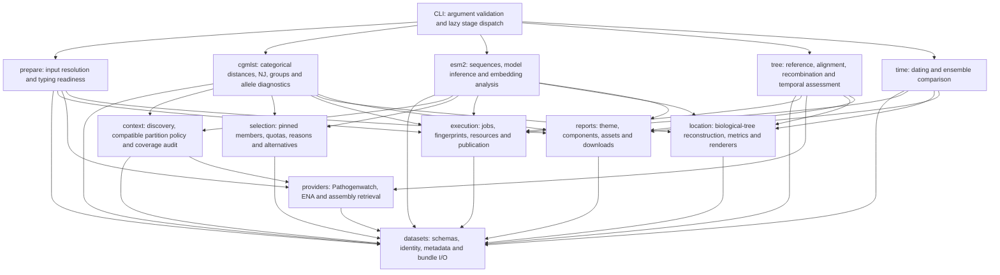

# ChronoClade tool suite redesign

Design specification and implementation status, 10 October 2026.

## Implementation status

| Component | Implemented | Validation or remaining boundary |
| --- | --- | --- |
| `prepare` | Saved bundles, assemblies, accessions and Pathogenwatch collection IDs/URLs; exact metadata enrichment; configured typing and reference readiness | A live 23-genome collection was retrieved. Pasteur/HierCC reference access remains external. |
| `cgmlst` | Complete matching profile context, explicit LIN5/6/7 or HierCC partitions, full NJ/ordination, neighbours and group sensitivity | Synthetic 10,000 × 629 full-profile analysis was exercised; large blocks use compiled distances and RapidNJ. |
| `esm2` | Genome-level matched-locus distances, ordination, neighbours, grouping, descriptive date diagnostics and shared selections | Real 8M/35M inference exercised on CPU/MPS with controlled sequence fixtures; natural within-lineage biological adequacy remains unvalidated. Allele catalogue acquisition requires supplied reference data. |
| Selections | Mandatory inputs/pins/raw-distance nearest ties, portable checked binary or tabular evidence, reproducible alternatives, coverage/overlap | Alternative selections describe sensitivity, not population confidence intervals. |
| `tree` | Exact selected-assembly acquisition, SNP and recombination-corrected trees, independent reports and clustered date assessment | Genuine native runs use SKA, IQ-TREE and ClonalFrameML. |
| `time` | Independent saved-tree dating, evidence gates, own report and shared-anchor ensemble comparison | Missing/unsupported temporal evidence produces an explicit unsupported report. |
| Shared reports | Approved report style and location network, metadata ordination controls, stage results and downloads | Embedding distances never become ancestral-state or mutation-rate evidence. |
| Execution | Isolated command environments, checked local jobs and generated SLURM scripts; tree/time resume and invalidation | No live SLURM cluster was available to test submission. cgMLST owns a fresh output directory per revised run. |

See the [independent suite](independent-suite.md), [large-block backend](cgmlst-scale.md),
[tree stage](tree-stage.md), [time stage](time-stage.md) and
[genome ESM2 analysis](esm2-genomes.md) for executable contracts and validation details.

## Public interface

Five analysis commands, each independently executable and each owning its output.
cgmlst and esm2 are alternative exploration/selection routes after prepare:

```text
chronoclade prepare <input> --species <species> --out prepared/
chronoclade cgmlst prepared/dataset.json --out cgmlst/
chronoclade esm2 prepared/dataset.json --out esm2/
chronoclade tree cgmlst/<block>/selections/selection-001.json --out tree/
chronoclade time tree/tree.json --out time/
```

Tree accepts the same selection contract from either cgmlst or esm2. Running both
exploration routes on a frozen dataset permits a direct comparison of their
selected representatives and downstream SNP/dating results.

Assemblies, accession lists with metadata, and Pathogenwatch collection IDs or
URLs are prepare inputs. Explicit input options will disambiguate these forms.
Species is required for new assemblies. Installation and configuration are
supporting operations, rather than additional analysis stages.

Each command consumes saved evidence from its predecessor. Tree does not rerun
cgMLST or select new genomes. Time does not rebuild the SNP tree. Each command
has independent parameters, dependency checks, fingerprints and resumable jobs.
The same commands can be saved as local or SLURM job scripts. ChronoClade does
not submit those scripts, and execution on a real SLURM cluster remains untested.

### Package and dependency boundaries

Keep one repository, version and `chronoclade` CLI, with separate stage packages
for prepare, cgmlst, esm2, tree and time. Shared code is limited to dataset and
manifest contracts, identity/metadata handling, context retrieval and partition
policy, selection manifests, execution/caching and report components. Numerical
and scientific implementations belong to their owning stage. Shared services
must not import stage implementations or optional model libraries.

Use stage-specific installation environments/features and lazy imports. The CLI
and cgmlst must work without PyTorch, model weights or SNP/dating executables.
Prepare needs typing tools only when it actually calls profiles/assignments;
importing existing typing does not require them. Tree needs its alignment,
IQ-TREE, ClonalFrameML and PHIPack tools, plus temporal-testing dependencies when
that assessment is requested. Time needs its dating backend. esm2 alone requires
the validated ESM2 inference backend, PyTorch and explicitly acquired weights.

Python optional extras do not install arbitrary native executables; distinguish
them from Pixi/managed tool environments. The Pixi prepare, cgmlst, tree and time environments isolate the command dependencies; the default remains a development environment. Model/GPU dependency
conflicts can be isolated in an esm2 worker environment using the same saved
contracts. Pin model weights, extraction settings and runtime versions. No model
download occurs during installation of the base package or CLI startup.

## Shared dataset contract

One logical dataset, exposed through a Python dataset object with dataframe
access, is persisted as a bundle rather than a large dictionary hidden inside a
report. Its manifest is the authoritative entry point.

The bundle contains:

- A samples table: stable internal ID, readable accession/name, input/context
  role, species, MLST scheme/ST, collection date interval and precision, country,
  region, NUTS2 when actually known, host, isolation source, and assembly reference.
- A locus catalogue and categorical allele matrix for each compatible scheme.
  Every scheme locus remains present; missing calls are null internally and may
  be exported as 0. Missing is never treated as an allele match.
- A lineage table: complete cgLIN code or HierCC assignments, typing scheme,
  scheme/database version, assignment method and resolution status.
- An identity crosswalk connecting local IDs, Pathogenwatch IDs, assembly/run/
  BioSample accessions, including unresolved or ambiguous matches.
- Field-level provenance, conflicting source values, exclusions and retrieval
  status. User-supplied values take precedence; provider values and conflicts
  remain inspectable.

CSV/TSV exports are provided for inspection. Typed columnar storage is the primary
large-dataset representation. All manifests include schema and software versions,
parameters, exact IDs, relative artifact paths, checksums and completion status.
Credentials are referenced by configuration, never copied into bundles.

## Concrete ownership and reuse

The following is the target dependency graph, not a description of completed
migration. Arrows mean an allowed Python dependency. The five stage runners
exchange saved manifests; they do not call each other's runners.



Each box has an owner and a narrow responsibility:

| Owner | Canonical responsibilities | Must stay elsewhere |
| --- | --- | --- |
| `datasets/` | Manifest validation, typed table access, immutable sample IDs, crosswalk resolution, date intervals, metadata precedence and artifact references | Provider requests, distances, plotting and native commands |
| `providers/` | Source-specific parsing, pagination, raw snapshots, exact metadata links and validated assembly acquisition | Partition choice, sample selection, model inference and reports |
| `context/` | Same-ST discovery, scheme/version compatibility, explicit cgLIN/HierCC partition policy and retrieval coverage | Automatic deepest-prefix narrowing and representative selection |
| `selection/` | Mandatory IDs, pins, distance-aware representatives, quotas, reproducible alternatives and coverage evidence | cgMLST/ESM2 distance calculation, tree building and clock-fit optimisation |
| `execution/` | Input/tool fingerprints, stage jobs, bounded resources, local/SLURM execution and atomic manifest publication | Scientific gates, provider identities and HTML copying |
| `location/` | Frozen-tree state-change reconstruction, uncertainty, centralities, metadata composition, palette and static/interactive views | cgLIN partition discovery, embedding inference and stage orchestration |
| `reports/` | Existing theme, labelled figure/table/download components, report pages and indexes | Computation, metadata inference and provider access |
| Stage package | Its scientific engine, settings, result schema adapter and runner | Another stage's engine or report-private helpers |

Do not create all these packages as empty shells. Extract a boundary when the
first two real consumers need it, move its implementation and migrate those
call sites together. Shared code must delete duplication or remove a dependency;
a forwarding wrapper around a stage helper does neither. The names above define
ownership; the first foundations change can use `datasets/` and `location/`
without prematurely relocating every existing file.

The foundation extraction accompanying this design uses the actual names
`datasets/`, `location_network/`, `metadata_dates.py`, `selections.py` and
`report_components/styles.py`, with `typing_scopes.py` owning neutral typing
namespace identity and compatibility. The diagram's location, selection and report
owners map to those modules. `profile_network.py` remains the cgLIN-specific view
adapter while common reconstruction/rendering moves beneath `location_network/`.
This is a concrete first boundary, not a completed stage-package migration.
Provider/context separation, independent tree/time runners and the complete
genome-level esm2 route remain subsequent work.

The former provider-owned date decoder is now in `metadata_dates.py`, imported
by both provider normalization and prepared-data adaptation. Scheme/version/
frozen-export scope decoding is owned by `typing_scopes.py`, imported by both
context comparison and datasets. The shared dataset package imports neither
Pathogenwatch nor context-refinement machinery. Profile matrix scopes preserve
an explicitly declared database SHA256: conflicting fingerprints and known/
unknown fingerprints require separate matching catalogues and cannot be merged.

### Contracts shared by the stage runners

Use explicit dataclasses/enums for Python values and versioned, validated JSON
for public manifests. Dataframes are an access view of typed tables; they do not
become the manifest or permit silent dtype/identity coercion. Decode provider
responses once at the boundary rather than inspecting arbitrary nested mappings
in every downstream renderer.

| Contract | Required evidence and invariants |
| --- | --- |
| Dataset manifest | Schema/software version; stable dataset identity; samples/profiles/lineages/crosswalk/provenance artifact paths, hashes, row counts and statuses; exact input/context membership. Profiles have a known or explicitly incomplete locus catalogue, compatible scheme/version and a missing-call mask. |
| Identity resolution | One internal ID maps to typed provider/accession aliases and a resolution status. Ambiguous aliases are retained as ambiguous, never resolved by nearest profile, filename similarity or first match. Identical profiles do not imply identical specimens. |
| Metadata value | Value, raw source value, provider/source ID, precedence, conflict evidence and availability status. Dates use start/end/precision plus eligibility reasons. Unknown location/host remains a visible missing category. |
| Partition manifest | Source dataset hash, scheme/version/database scope, chosen policy/depth, disjoint exact IDs, unresolved inputs, requested/retrieved/usable counts and completeness status. A nested prefix is a child, not an overlapping peer block. |
| Distance evidence | Ordered IDs, metric identifier and units, compatible scheme/model provenance, callable or missing-data evidence and artifact hash. Allele distances retain raw differences and jointly called denominators; embedding distances have their own units. |
| Selection manifest | Source dataset/partition hashes, source method and distance evidence hash, all mandatory input/pin/nearest IDs, ordered selected IDs, per-ID reasons, seeds, quotas and budget overruns. Tree consumes these exact IDs without replacement or rerouting. |
| Stage job/result | Input manifest hashes, stage/parameter/tool versions, execution resources, artifact paths/hashes and explicit pending/running/complete/failed status. Unsupported scientific evidence is a completed assessment with a reason, not an invented output. |
| Biological tree evidence | Tree path/hash, exact tips, input dataset/selection hash, source method and branch units, rooting policy/provenance and exclusions. Its kind is conventional allele NJ, assembly SNP/corrected phylogeny or dated biological tree; embedding coordinates are not a biological tree. |
| Location result | Biological-tree source evidence, exact analysed IDs, metadata field/known/unknown counts, root and reconstruction method, coherent displayed history, directed counts, exact pair ranges, centrality definition and root-sensitivity audit. Nearest-observation edges are separately typed and labelled. |
| Ensemble manifest | Independent selection/run manifest references and declared common anchor/target IDs. Include failed/unsupported runs and assessable denominators; never compare mutable run-local cluster numbers as shared identities. |

Artifact paths inside a bundle are relative and validated against its root.
References to another bundle include its manifest checksum. Write artifacts to
their own job namespace and publish the manifest last; a failed replacement must
leave the previous complete bundle readable. A report receives validated stage
results and artifact references, rather than discovering science from whatever
files happen to exist in a directory.

### One location component for cgmlst, esm2 and tree

Reuse the approved interaction, country colours, graph metrics, optimal-history
count ranges and established report style. Extraction changes ownership, not the
scientific calculation or its displayed meaning. Store tree-kind, branch units
and root evidence in the result so the same renderer can label an allele NJ tree
and a recombination-adjusted SNP tree correctly.

Use two explicit inputs to location rendering:

1. A metadata composition table or ordination with linked IDs. Every stage,
   including esm2, can show country/region/host distributions and metadata-coloured
   points without reconstructing ancestral states.
2. A `BiologicalTreeEvidence` and its matched metadata, used by a separately called
   reconstruction engine. cgmlst supplies its full comparable conventional NJ;
   tree supplies its selected-sample corrected SNP tree. esm2 can supply a frozen
   conventional cgMLST baseline and label that source, or omit the reconstructed
   network. ESM2 vectors, embedding-space coordinates and an embedding NJ do not
   satisfy this input contract.

The shared reconstruction engine does not infer sample groups. Stage/context
owners supply the intended whole-block IDs and optional declared views. Report
filters operate on a saved result and retain the original denominator; a filtered
graph is labelled a view, not a new ancestral reconstruction. Reconstructing a
subgroup is an explicit new result with its own tree, root and IDs.

The existing `country_network.py` TreeTime marginal-state output and
`profile_network.py` exact parsimony output are different scientific products.
Share labels, palettes and rendering contracts where valid; keep distinct
method-specific adapters and uncertainty fields. Do not rename marginal support
as an exact range or force two products into a generic ambiguous `confidence`
field. Nearest-country connections remain observations with their own metric;
SNP/embedding connections never inherit an allele-difference label.

## prepare

Prepare resolves and types the supplied genomes. It does not choose analysis
blocks or retrieve public-context assemblies.

1. Resolve collection membership or accession identity and freeze the evidence.
2. Retrieve existing Pathogenwatch metadata, cgMLST and lineage assignments.
3. Acquire input assemblies when necessary for missing typing.
4. Run profile calling and lineage assignment as separate completion checks.
   An existing profile with missing cgLIN/HierCC still needs assignment.
5. Use configured Pathogenwatch tools/databases for Klebsiella cgMLST/cgLIN and
   E. coli cgMLST/HierCC. Never borrow a neighbour's lineage assignment.
6. Fill missing host, source, date and location from exact linked ENA/BioSample
   records where available, preserving raw values and source provenance.
7. Write the dataset and a preparation/coverage audit.

The adapter for Pasteur-authenticated reference data has explicit configured,
unavailable and ready states. Existing/frozen typing can proceed without the key.
New assignment requiring an unavailable reference database remains unresolved,
with a specific reason. Tool installation and reference-data availability are
reported separately.

Metadata can be incomplete: the prepared table retains those samples and their
missing-value status. No country, region, date precision or host is invented.

## cgmlst: complete profile analysis

### Context discovery and partitioning

MLST ST identifies the initial searchable public pool. Compatible cgLIN prefixes
then define analysis blocks below the clonal-group level. For Klebsiella, the
proposed default is level 5, with explicit level 6 or 7 selection. This retains a
broad block while meeting the requirement to work below CG/ST scope. The current
policy of automatically narrowing to the deepest prefix with enough context is
not the default for this redesign.

The index first shows counts available at levels 5, 6 and 7 and the chosen policy.
It then lists disjoint input partitions, their prefixes, input counts, public
matches, usable profiles, exclusions and links to individual reports. Prefixes
from different lineage schemes/databases are never merged. E. coli uses a
scheme-specific HierCC policy, not Klebsiella level numbers.

Retrieve every accessible matching context profile, lineage assignment and
metadata record in each chosen block. Context assemblies are deferred to tree.
Record discovered, requested, retrieved and usable counts separately, plus
pagination/export completeness. Report accessible matches, not an unsupported
claim of global completeness. Deduplicate by source identity while preserving
different samples with identical profiles.

Partitions form a hierarchy: a level-5 block and its nested level-6 block cannot
be accidentally counted as two overlapping peer datasets. Unassigned inputs
remain visible in the index and preparation audit.

### Outputs within each block

- Country/region and host composition for the entire block.
- A full NJ tree containing every comparable profile. A collapsible interactive
  view can aggregate identical profiles for display while retaining their IDs,
  multiplicities and metadata; the complete Newick remains downloadable.
- The existing approved location state-change network, including its interaction,
  centrality metrics and uncertainty. It uses the full comparable block.
- PCoA of categorical allele distances, retaining all samples. Point shape or
  outline distinguishes input/context; colour toggles between country/region,
  collection date, host and genetic cluster. Unknown values remain visible.
- Root-to-tip date regression with the fitted line, root method, dated count,
  date bounds, slope, fit and uncertainty diagnostics.
- Genetic groups, their country/host/year breakdowns and separation evidence.
- Nearest public relatives per input, with raw allele differences, jointly called
  loci, normalized distance, ties, date, location, host and lineage membership.
- One or more representative selections for subsequent tree analyses.

PCoA is the correct name for the existing distance-based ordination. Numeric
allele identifiers are categorical labels and are not fed to ordinary numeric PCA.

### Root-to-tip units and interpretation

The regression uses the full comparable NJ tree and a reproducible root policy;
it replaces the current arbitrary first-tip root. Root provenance and sensitivity
are saved. Date intervals are carried through the diagnostic.

With a fixed set of jointly callable loci, distances and slope can be expressed
as allele differences and allele differences/year. When callable denominators
vary, the primary distance is mismatch fraction. A full-scheme scaling may be
shown as *scheme-equivalent allele differences/year*, with its locus count and
normalization stated explicitly; it is not a raw observed allele-change rate.
The regression is exploratory, and unsupported/negative rates remain results
rather than being forced positive. Formal SNP temporal-signal assessment belongs
to tree. Neither regression alone nor a long NJ branch establishes expansion.

### Genetic groups and unusual branch patterns

Genetic groups are defined before inspecting country, host or dates. They are
not geographical groups. Existing finer LIN labels are annotations and useful
candidate boundaries, rather than automatic proof of a distinct cluster.

The first implementation should evaluate a small, declared range of
scheme-appropriate allele-distance thresholds. Use bounded-diameter groups and
NJ clade/separation evidence, drawing on TreeCluster-style clade partitioning.
Validate candidates against actual pairwise allele distances and callable-locus
coverage. Compare separation, within-group diversity and stability under locus
resampling/nearby thresholds. Save the chosen rule and diagnostics; allow a manual
threshold and a result of no clear subdivision.

Avoid the single-linkage chaining problem and avoid clustering only the two
displayed PCoA axes. A candidate with a long stem and compact descendants receives
descriptive stem length, within-group diversity, support, sample count and date
distribution. Subsequent temporal and location associations are separate
summaries. Do not use the exploratory allele slope to impose a universal branch
threshold or label rapid expansion automatically.

Country breakdowns are available for every genetic group through one selectable
table/figure. Do not generate a separate page and repeated figures for every
hierarchical level. Subgroup-specific reconstructed networks are a later feature;
filtering the whole-block graph is not presented as a new reconstruction.

### Representative selections

The user confirmed that multiple selections mean alternative representative sets
from the same block. Default one; proposed flags are `--subsamples 1` and
`--context-size 50`, with input genomes additional to the context budget.
Their purpose is to assess sensitivity of rigorous SNP and dating results to
genome selection: for example, five selections produce five corrected trees and,
when temporal evidence supports them, five dated trees.

Each alternative preserves every input, explicit pins and the required nearest
neighbours. Allocate remaining slots across genetic groups, dates, location/host
strata and NJ diversity; vary interchangeable representatives reproducibly using
recorded seeds. Missing dates do not automatically exclude a useful genome.
Keep outlying root-to-tip samples visible rather than selecting only genomes
that make the clock regression look good.

Save sample IDs, selection reasons, quotas, missing metadata, nearest-neighbour
ties, budget overruns and overlap between alternatives. Mandatory members may
exceed a requested budget; report that rather than silently dropping them. Do
not promise disjoint sets or distinct results when there are too few alternatives.

Each selection manifest references its immutable source dataset/partition and
can independently be supplied to tree. The full cgMLST tree is never pruned to
the selection. An optional selection overlay helps inspect what will proceed.

### Comparing repeated subsamples

Define comparison targets before sampling. Retain shared input genomes and a
declared set of anchors spanning the genetic groups of interest. Each target
ancestor is identified by an explicit anchor set, not by a changing run-specific
cluster number. Do not equate the root of every sampled tree with the ancestor
of the entire 10,000-genome block. The common-anchor MRCA can have different
descendant membership across runs; that difference is itself reported.

Keep selection strata, analysis settings, reference strategy and target IDs fixed
while varying the nonmandatory representatives. Where a common reference is
appropriate, record it once for the ensemble. Independently inferred
recombination masks and callable alignment lengths are audited per run. Cache
assembly acquisition across runs, while keeping scientific outputs independent.

Tree and time accept an ensemble manifest as well as a single-run manifest, so
the suite supports running every selection without a separate comparison
command. Each run still has its own report and status. Time
also writes an ensemble comparison index containing:

- Target-MRCA date estimates and each run's date uncertainty, shown as a forest
  plot, plus the between-selection median, range and spread.
- Temporal-signal and dating status for every requested run, including failures
  and insufficient evidence; successful runs do not erase unsuccessful ones.
- Rate estimates, dated sample counts, date range, reference/mask/alignment
  coverage and selection overlap, so differing inputs remain assessable.
- Cluster co-membership and supported splits on shared genomes/anchors, with
  the number of runs in which a pair or split was actually assessable. Unrelated
  run-specific cluster numbers and whole-tree distances on different tip sets
  are not compared directly.
- Coverage of the full cgMLST block: genetic groups, time/location strata,
  allele-distance-to-selected-representative distribution and cumulative unique
  genomes included.

Between-selection spread measures subsampling sensitivity. It is not a formal
population confidence interval or a replacement for within-run dating
uncertainty. Low spread alone cannot rule out a shared sampling/model bias.
Five runs are an initial diagnostic, not proof of convergence. If results remain
variable, increase representatives or target undercovered strata, and evaluate
several selection sizes. Judge stabilization against a declared scientific
tolerance and coverage, rather than selecting the runs with the best clock fit.
The default 50-context budget is a starting resource setting, not a guarantee
of adequate representation for a block of 10,000 genomes.

## esm2: optional sequence-embedding exploration

esm2 consumes the same prepared dataset and shared public-context/partition
policy as cgmlst. It resolves actual allele DNA sequences from compatible
catalogues or retained caller outputs, translates valid coding sequences and
embeds unique proteins once. Sequence availability and translation failures are
audited; allele IDs/hashes alone cannot reconstruct a sequence. Catalogue
enrichment can be requested during preparation and cached for subsequent runs.

Preserve locus identity when building genome representations, explicit
missing-locus masks and model provenance. Do not silently average away the small
number of variable loci or treat missing embeddings as ordinary zero vectors.
Save vectors, embedding distances, exploratory groups, nearest neighbours and
metadata-linked visualisations in an independent report using the existing
style. Export the same selection and ensemble schemas as cgmlst, with the source
method, distance definition and selection evidence recorded.

Compatible outputs mean a common dataset/selection interface and report
structure, not interchangeable scientific units. Embedding distances are not
allele differences, SNP substitutions or changes/year. Until validated, an
embedding NJ/tree, clock slope or ancestral-state network is not substituted for
the approved allele-based network. If that network is included in an esm2 report,
calculate it from the conventional cgMLST NJ baseline and label its source.

Benchmark allele distances, DNA-sequence distances and ESM2 representations on
the same frozen samples. Assess corrected SNP neighbour/cluster agreement,
missing-locus robustness, synonymous-variation loss and selection coverage.
Use separate downstream tree/time outputs to compare selection strategies.
Keep the module experimental until the relevant within-lineage performance is
demonstrated. Model inference and structure prediction are distinct; this
module needs embeddings, not ESMFold structure prediction.

### Descriptive collection-date comparison

The implemented optional report accepts a prepared dataset, validated saved
protein embeddings and explicit sample–locus–record mappings. It preserves the
established full-report stylesheet. Automatic allele acquisition/translation,
genome clustering and selection remain outside this implementation.

Keep two named panels and their scientific units distinct. The conventional
cgMLST panel shows rooted NJ root-to-tip distance in mismatch fractions on a
fixed common callable-locus denominator; its descriptive slope is mismatch
fraction/year. The protein panel shows mean per-locus cosine distance to a fixed
real reference sample on a frozen callable protein panel; its slope is mean
locus cosine distance/year. Use the same real reference as the cgMLST tip root
where that reference belongs to the cohort. Reference and locus-panel selection
are independent of dates. Compatible cgMLST cohorts are plotted separately and
unavailable cohorts retain their status rather than borrowing another tree.

Share location colours and distinguish input/context samples by marker shape and
outline. Show collection-date interval bars, midpoint fitted lines and residuals.
Retain undated finite distances separately and export every sample row, missing
locus and date exclusion. Require three distinct date midpoints for a fit;
constant distances retain slope zero and explicitly undefined correlation/R².
Record prepared/mapped/eligible/dated counts, root/reference selection, callable
loci, model/checkpoint/runtime provenance, and scheme/database versions. Provide
CSV/JSON evidence and SVG/PNG figures beside the offline HTML report.

The comparison is exploratory and has no formal temporal-signal gate,
confidence intervals, p-values or embedding-based ancestry/TMRCA. Date bars
describe collection precision. Synonymous DNA changes producing identical
proteins are invisible to embeddings; a protein distance/date slope is not a
substitution rate. Formal temporal testing and dating remain the conventional
assembly-based tree/time route.

### Laptop benchmark and SLURM execution

Implement the optional embedding engine separately from its performance study.
Compare ESM2 8M and 35M on the same representative protein allele sequences,
using CPU and Apple MPS where available. Record hardware, runtime versions,
model/checkpoint hashes, sequence-length distribution, token budget, batching,
precision, cold model-loading time, warm inference throughput, process memory
and accelerator memory where measurable. Synchronize accelerator operations
before timing. Benchmark fresh embeddings separately from cached reuse; never
present cache speed as model inference speed.

Embed unique protein sequences once and preserve their sample/locus mapping.
Include closely related variants and identical proteins from synonymous DNA
alleles. Runtime alone cannot establish biological adequacy; benchmark neighbour
and cluster preservation separately before assigning a scientific default.
Use the laptop runtime/memory measurements to recommend an easy 8M or 35M
starting setting, and retain explicit model selection. Current local hardware
is an Apple M1 Pro with 32 GiB unified memory. MPS compatibility must be
exercised, not inferred from PyTorch's general Apple support.

The same engine supports explicit CPU, MPS and CUDA devices with an audited
automatic choice. Explicitly requested unavailable devices fail clearly;
automatic fallback records the actual device. SLURM runs the ordinary command
in a batch job, with user/site configuration for partition, account, GPU request,
CPU threads, memory and wall time. CPU execution does not require a GPU node.
Prepare checkpoint weights and the runtime on a login/staging node; compute-node
inference can run offline using those local checkpoints and input files.
For GPU work, allocate one GPU per inference worker and shard unique-sequence
batches through explicit manifests when using arrays. Give workers separate
output/cache namespaces and assemble validated shards afterwards. Keep model
loading/cache costs and missing/failed shards visible. A documented SLURM script
is not a claim that a real cluster run has been tested.

## tree: assembly-based, recombination-adjusted analysis

Tree accepts one selection manifest, acquires only its missing assemblies and
uses exactly its recorded genomes. Assembly failures produce an explicit audit
or fail the selection; replacement genomes are not chosen implicitly.

Reuse the reference-selection, alignment, phylogeny and recombination pipeline.
Save the reference, tool versions, alignment site counts, raw and corrected trees,
recombination outputs and QC exclusions. Retain undated samples in tree building
where supported; date-dependent calculations identify their eligible subset.

The independent HTML report presents the selected-sample overview, corrected tree,
geographic/host summaries, the approved network rebuilt on this tree, and temporal
diagnostics/date-randomisation results. It identifies the corrected tree's sample
denominator and preserves links back to the full cgMLST block. SNP relationships
and cgMLST nearest-neighbour evidence have distinct labels.

The temporal test includes root-fitting provenance, partial-date handling,
randomisation settings and eligible samples. Genetic/date confounding is checked;
a high regression fit alone is not the gate. Tree writes `tree.json` and a
machine-readable assessment ready for time, even when dating is unsupported.

## time: dating

Time consumes the saved corrected tree, its alignment/site-count evidence,
metadata and temporal assessment. It validates hashes and does not repeat tree
construction or change the selection.

Use the existing supported dating approach and temporal gate. Produce the dated
tree, rate/date uncertainty and existing time-based results in a separate HTML
report. If the evidence does not support dating, write the assessment and report
without manufacturing a dated tree. Dating overrides, if supported, are explicit
and recorded. A failed dating run does not remove valid tree or cgMLST products.

## Report presentation

Retain the established full-report visual style and the approved interactive
network. Reports are result sections with named plots/tables, dataset counts,
units, legends and downloads. Remove the question-and-answer narrative and do
not reintroduce REP labels. Scientific interpretation can be developed later.

Prepare has a concise input/readiness audit; cgmlst, tree and time each have their
own analysis report. The partition index links the per-block reports and their
available selections. Alternative tree/time analyses have separate directories.

## Scale and implementation order

The dense backend remains limited to 1,500 records. Larger blocks now use
blockwise compiled categorical distances, disk-backed square matrices,
RapidNJ, iterative leading-axis PCoA and a collapsible full-tip tree renderer.
Large distance evidence is binary; requested pair rows can be exported without
expanding every pair into CSV. See [resource benchmarks](cgmlst-scale.md).

All-profile exact distance/tree work still has quadratic storage/work components.
Any approximate ordination is labelled and still locates every genome. Benchmark
the network reconstruction and uncertainty as well as distances and trees.
Resource estimates distinguish laptop and cluster requirements; no silent
subsampling is used to claim complete analysis.

Implementation sequence:

1. Dataset/manifest contracts, five command entry points and independent caches.
2. Prepare separation, typing-completion fixes, identity/metadata enrichment and
   explicit database readiness.
3. cgmlst partitioning/full context retrieval and full-tree display, preserving
   existing network fixtures before changing routing.
4. PCoA metadata controls and reproducible allele/date diagnostic.
5. Genetic group calibration and alternative selection manifests.
6. Independent tree with temporal testing, followed by independent time and
   their multi-selection comparison report.
7. Compiled scale backend and benchmark-driven resource settings.
8. Optional esm2 package/environment and benchmarked alternative selection route,
   reusing the established contracts rather than changing cgmlst semantics.

Acceptance uses the ten Greek inputs, exact partition/count audits, unchanged
network calculations on fixed inputs, missing-profile/lineage/date fixtures,
selection-to-tree identity checks and independent resume/invalidation checks.
Exercise actual prepare → cgmlst → tree → time outputs where the required data
and tools are available. Report a skipped/blocked module explicitly. Add scale
benchmarks and verify rendered plots/tables individually before a final report
browser check.

### Parallel work packages and integration gates

See [architecture-review.md](architecture-review.md) for findings verified in
the current checkout. Work packages below have separate file ownership. Agree
the contracts first; implement shared foundations and isolated engines in parallel
only after their input/output boundary is fixed.

| Package | Owns | Depends on | Reviewable completion gate |
| --- | --- | --- | --- |
| A: dataset foundations | `datasets/`, schema fixtures and contract tests | Agreed manifest schemas | Portable bundle round-trip, checksum/path validation, stable IDs, missing calls/date precision/conflicts retained; no provider/stage/model imports. |
| B: location extraction | `location_network/`, migrated network/widget/tree-renderer call sites and parity fixtures | Tree/result contract from A | Existing fixed-tree directed counts, ranges, centralities and palette unchanged; renderer labels source/units; no private stage imports. |
| C: report shell | `reports/` theme/components/assets; migrated report helper call sites | Artifact/location contracts from A/B | Approved full-report style and network controls retained, mobile/desktop render checked, no report-private cross-imports or science computed in HTML. |
| D: prepare/context | Provider adapters, prepare runner and context/partition services | A | Existing profile with missing assignment handled explicitly; no context assembly acquisition in prepare; exact identity and partition/coverage counts on Greek inputs. |
| E: cgmlst/selection | Categorical engines, whole-block reports and selection/ensemble writers | A/B/C plus D partitions | Full comparable NJ/PCoA kept; ties and mandatory budget overruns retained; source IDs/hashes stable and selections reproducible. |
| F: tree/time separation | Independent tree and time runners, corrected-tree/assessment/dating contracts | A/B/C and selection from E | Tree uses exactly selected IDs; time reads saved corrected tree and gate; independent invalidation, unsupported-date result and failures preserved. |
| G: optional esm2 | Existing inference foundation plus catalogue mapping, genome distance/selection adapter and benchmark | A/C, D partition, E selection contract | Lazy dependency boundary; real sequence mapping and missing masks; benchmark/biological comparison; conventional tree required for any state-change network. |
| H: scale backend | Distance/tree/ordination implementations behind cgmlst interfaces | E correctness baselines | Same small-input numerical evidence, complete IDs at benchmark sizes, bounded memory/runtime evidence; no silent subsetting. |

The initial change establishes A and B plus shared selection/date/style ownership
and this reviewed design. It does not complete the full selection policy in E,
the report decomposition in C or D–H. C can follow alongside D; E follows validated context partitions.
F can start from a frozen example selection while E develops, but cannot claim
suite integration until E's emitted manifest is exercised. G can benchmark its
existing protein engine in parallel; its genome-selection and location integration
wait for validated A/D/E contracts. H starts from the fixed small-data baseline,
not by relaxing the current guard before replacement backends exist.

Integration is accepted in this order:

1. **Boundary gate:** schemas, ownership and import direction validated; shared
   packages import no stage engines; CLI help works without model/native tooling.
2. **Behaviour gate:** fixed inputs preserve approved network results/style and
   metadata/identity semantics. Extracting modules is reviewed separately from
   changing science; intentional scientific changes need their own fixtures.
3. **Stage gate:** each real command owns a complete, portable output; changing
   time settings does not rebuild tree/cgmlst, and changing a selection does not
   overwrite another selection's report. Interrupted publication is recoverable.
4. **Scientific gate:** partition, denominator, selection, root and temporal
   evidence matches reported labels; unsupported/failed runs remain visible.
5. **Worked-example gate:** actual prepare → cgmlst → tree → time from ten Greek
   inputs, then an alternative selection and independent resume/invalidation.
   Record unavailable data/tools and blocked commands explicitly.
6. **Scale/experimental gate:** separately exercised large-data and ESM2 results
   with resource/biological evidence. A small Greek run is not proof of scale or
   embedding adequacy.

## Research informing the design

- [Klebsiella dual barcoding and genetic discontinuities](https://pmc.ncbi.nlm.nih.gov/articles/PMC9254007/):
  allele-based population structure and stability of clustering thresholds.
- [TreeCluster](https://journals.plos.org/plosone/article?id=10.1371/journal.pone.0221068):
  explicit clade/diameter constraints; thresholds require scheme calibration.
- [Genetic structure and temporal-signal testing](https://besjournals.onlinelibrary.wiley.com/doi/full/10.1111/2041-210X.12466):
  genetic/date confounding and grouped randomisation.
- [GrapeTree](https://pmc.ncbi.nlm.nih.gov/articles/PMC6120633/) and
  [RapidNJ](https://github.com/somme89/rapidNJ): large profile datasets need
  purpose-built calculation and display approaches.
- [Pathogenwatch cgMLST](https://cgps.gitbook.io/pathogenwatch/technical-descriptions-of-analysis-tools/lineage-and-genotyping/cgmlst),
  [Klebsiella lineage tools](https://github.com/pathogenwatch-oss/klebsiella-lincodes),
  [hclink](https://cgps.gitbook.io/pathogenwatch/technical-descriptions-of-analysis-tools/lineage-and-genotyping/finding-hiercc-codes-with-hclink),
  and [ENA programmatic retrieval](https://ena-docs.readthedocs.io/en/latest/retrieval/programmatic-access.html).
